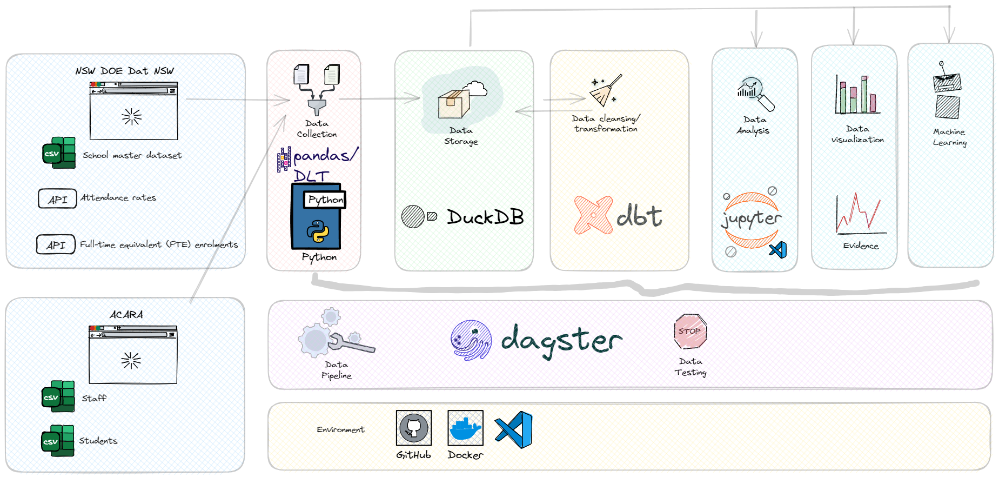
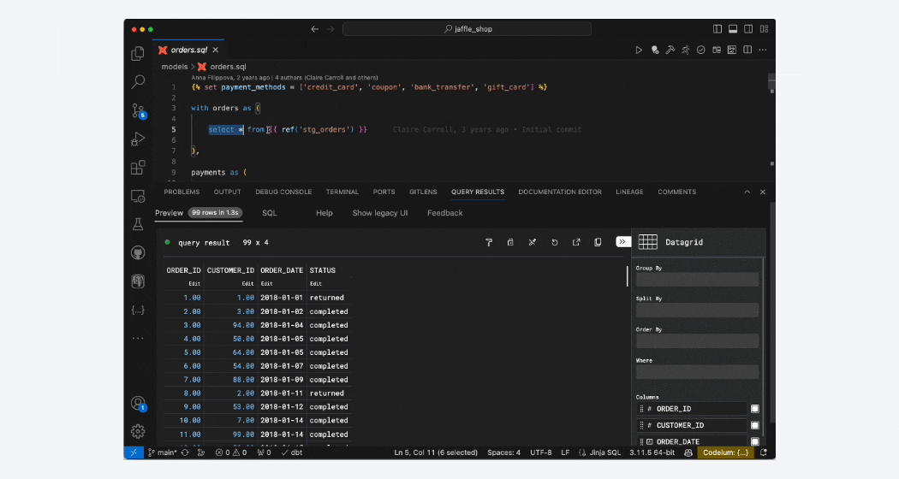
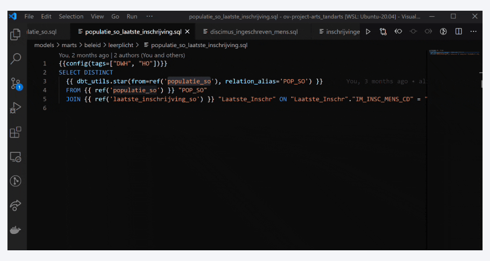
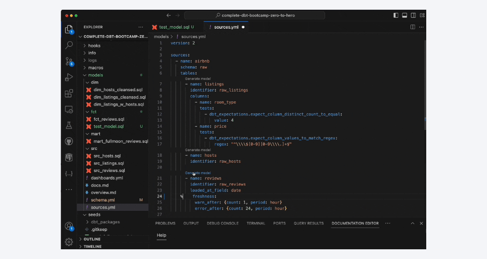
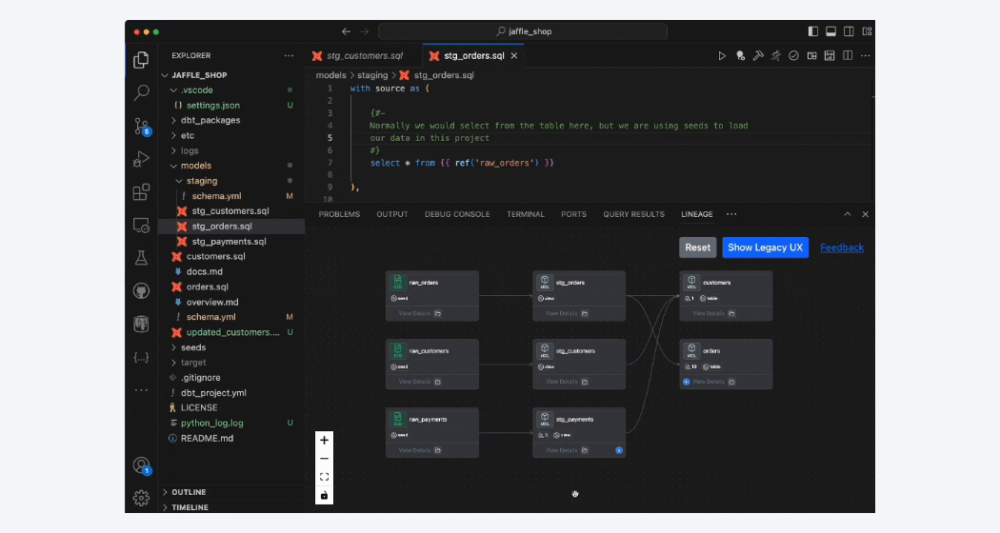

<!--  -->


# Welcome to New South Wales Department of Education (NSW DOE) data stack in a box


<!-- [](https://github.com/astral-sh/ruff)
[](https://www.getdbt.com/)
[](https://dagster.io/) -->


This is an data-stack-in-a-box based data from [NSW Education Data](https://data.nsw.gov.au/). With the push of one button you can have your own data stack!


## Objectives

### Main quests
[NSW Department of Education](https://education.nsw.gov.au/) data stack in a box has two objectives:
1)	Getting humans excited about the publically available data curated by NSW Department of Education and our partners.
2)	Simple one click totaly free 💲 datastack, aiding in learning and proof of concepts.


### Side quests
- Level up our data stack by demoing features in the data stack that we are lacking or need to improve in [NSW Department of Education](https://education.nsw.gov.au/). These demos will start the conversation on what features we want to prioritise.
- Help identify engineering talent during the interview phase by using the project as a case study

## TL;DR

### Data Stack

> [!IMPORTANT]
> Click below 👇🏼 to setup your own free data stack packed with [NSW Department of Education](https://education.nsw.gov.au/) data.

[](https://codespaces.new/wisemuffin/nsw-doe-data-stack-in-a-box?quickstart=1)


### Reports

[![Dashboard - evidence.dev]][Report]

## Audience
The project is designed to be very simple but allow you the flexibility for you to go as deep you like!
- **I want to analyse and gain insights into the data.** With the infrastructure free and deployed in one click you don’t need to worry about any implementation details. You can skip straight to analysing and training ML models on top of your own local warehouse.
- **Interested in modelling via SQL?** We got you covered with a environment setup for DBT.
- **Love DevOps and platform engineering?** Check out our Orchestration, CICD pipelines, and automation such as linting, data diffs ect.


## Overview of Project (Architecture) 🥨





> ![Info] We are simply going to extract data from the [NSW Education Data](https://data.nsw.gov.au/) and load it into our in memory data warehouse 🦆, model, clean, and analyse our data.
> behind the scenes uses https://ckan.org/ an open source data management system used by the likes of [Government of Canada](https://www.canada.ca/en.html), [NHS](https://www.nhs.uk/), [USAs Open Data](https://data.gov/).


> [!WARNING]
> The datasets from ACARA and NSW DOE are based on static urls. These URLs will break 💣 in the future. I will try to keep an eye out for this every few months. 🚧 TODO setup discussion on limitations with public datasets.


<!-- ## Option tooling (Architecture) 🥨

> ![Info] These components are purley for demoing purposes. They are not needed in the project.

- Tableau
  - ai monitoring
- Power BI
- Open Metadata
- DBT Cloud
  - semantic layer
  - column level linage
-->

## Information Management
### Data Catalog
🚧 TODO likley openmetadata see [example](https://sandbox.open-metadata.org/table/RedshiftProd.dev.demo_dbt_jaffle.customers/lineage)
### Conceptual Data Model

```mermaid
erDiagram
    "STUDENT ✅" {
        int student_id
        string name
        date date_of_birth
        string gender
        int school_id
    }
    STAFF {
        int staff_id
        string name
        string role
        date date_of_birth
        int school_id
    }
    COURSE {
        int course_id
        string course_name
        string description
        int school_id
    }
    ENROLLMENT {
        int enrollment_id
        int student_id
        int course_id
        date enrollment_date
    }
    CLASS {
        int class_id
        int course_id
        int staff_id
        string class_room
        date class_time
        int class_size
    }
    SCHOOL {
        int school_id
        string school_name
        string address
    }
    NAPLAN {
        int naplan_id
        int student_id
        date test_date
        string test_type
        int score
    }
    %% HSC {
    %%     int hsc_id
    %%     int student_id
    %%     date exam_date
    %%     string subject
    %%     int score
    %% }
    INCIDENT {
        int incident_id
        int school_id
        date incident_date
        string incident_type
        string description
    }
    ATTENDANCE {
        int attendance_id
        int student_id
        date attendance_date
        bool present
    }
    RETENTION {
        int retention_id
        int school_id
        int year
        float retention_rate
    }
    EARLY_CHILDHOOD_EDU {
        int ece_id
        int school_id
        string program_name
        string description
    }
    UNIVERSITY {
        int university_id
        string university_name
        string address
    }
    APPRENTICESHIP {
        int apprenticeship_id
        int student_id
        string trade
        date start_date
        date end_date
    }
    TRAINEESHIP {
        int traineeship_id
        int student_id
        string field
        date start_date
        date end_date
    }
    "STUDENT ✅" ||--o{ ENROLLMENT : enrolls
    COURSE ||--o{ ENROLLMENT : includes
    STAFF ||--o{ CLASS : teaches
    COURSE ||--o{ CLASS : consists_of
    SCHOOL ||--o{ "STUDENT ✅" : has
    SCHOOL ||--o{ STAFF : employs
    SCHOOL ||--o{ COURSE : offers
    "STUDENT ✅" ||--o{ NAPLAN : takes
    %% "STUDENT ✅" ||--o{ HSC : sits
    SCHOOL ||--o{ INCIDENT : reports
    "STUDENT ✅" ||--o{ ATTENDANCE : records
    SCHOOL ||--o{ RETENTION : tracks
    EARLY_CHILDHOOD_EDU ||--o{ "STUDENT ✅"  : provides
    "STUDENT ✅" ||--o{ APPRENTICESHIP : undertakes
    "STUDENT ✅" ||--o{ TRAINEESHIP : participates_in
    "STUDENT ✅" ||--o{ UNIVERSITY : enrolls_in

```
The data available publically for each entitity does not go down to a student. In some cases school level data is avaiable. But most entities only have data published at a state wide (NSW) aggregate level.

### Sources

#### Education Sources
🚧 add column for asset checks
| Name          | Method (API, CSV, Excel) | Contract Y/N | Description                            | Source URL |
| ------------- | ----------------- | ------------ | -------------------------------------- | ---------- |
| `Apprenticeship and Traineeship training contract` | Excel | ❌ | Apprenticeships and Traineeships combine formal study of a nationally recognised qualification with on-the-job training. | https://data.nsw.gov.au/search/dataset/ds-nsw-ckan-f7cba3fc-6e9b-4b8b-b1fd-e7dda9b49001 |
| `Average government primary school class sizes` | API | ❌ | The average class size for each grade is calculated by taking the number of students in all classes that a student from that grade is in (including composite/multi age classes) divided by the total number of classes that includes a student from that grade. | https://data.nsw.gov.au/search/dataset/ds-nsw-ckan-43438137-084e-4d50-81c0-ce741ea3b37b/details |
| `Early Childhood Education and Care program locations` | API | ❌ | NSW Early Childhood Education and Care program locations | https://data.nsw.gov.au/search/dataset/ds-nsw-ckan-c41c950f-043c-45ea-bf84-22d8037b74bb |
| `Enrolments` | API | ❌ | This data shows February census enrolment figures. All enrolments are self-reported in full-time equivalent (FTE) units and include both full-time and part-time students. | https://data.nsw.gov.au/search/dataset/ds-nsw-ckan-818ae0d8-d7fb-4b62-963c-7263fdb8e1ca |
| `Incidents` | API | ❌ | Incidents in public schools and how the department supports schools through incidents while still protecting the identity of students and staff. | https://data.nsw.gov.au/search/dataset/ds-nsw-ckan-43438137-084e-4d50-81c0-ce741ea3b37b |
| `Master dataset: NSW government school locations and student enrolment numbers` | CSV | ✅ | The master dataset contains comprehensive information for all government schools in NSW. Data items include school locations, latitude and longitude coordinates, school type, student enrolment numbers, electorate information, contact details and more. | https://data.nsw.gov.au/search/dataset/ds-nsw-ckan-78c10ea3-8d04-4c9c-b255-bbf8547e37e7 |
|`Resource Allocation Model (RAM)` | CSV | ✅ | The Resource Allocation Model (RAM) was developed to ensure a fair, efficient and transparent allocation of the state public education budget for every school. The model recognises that students and school communities are not all the same and that they have different needs which require different levels of support. | https://data.nsw.gov.au/search/dataset/ds-nsw-ckan-3ea5010a-89bd-46bf-be2a-13c82cc0e1bb |
|`Staff` | CSV | ❌ | -------------------------------------- | https://www.acara.edu.au/reporting/national-report-on-schooling-in-australia/staff-numbers||
|`Students` | CSV | ❌ | -------------------------------------- | https://www.acara.edu.au/reporting/national-report-on-schooling-in-australia/student-numbers||
| `Student attendance` | CSV | ❌ | This dataset shows the attendance rates for all NSW government schools in Semester One by alphabetical order. | https://data.nsw.gov.au/search/dataset/ds-nsw-ckan-b558a070-09f5-4941-a140-e60a744327bf |
| `Student retention rates at NSW government schools` | API | ❌ | The full-time apparent retention rate (ARR) measures the proportion of a cohort of full-time students that moves from one grade to the next, based on an expected rate of progression of one grade per year. It does not track individual students through their final years of secondary schooling. | https://data.nsw.gov.au/search/dataset/ds-nsw-ckan-c9fd51b3-506d-4707-b607-0b1853654ce6 |
| `University` | API | ❌ | NSW University Locations by campus | https://data.nsw.gov.au/search/dataset/ds-nsw-ckan-0d43537e-429a-4a71-8d12-92d2d45eccd0 |

#### Utilisation Sources
| Name          | Method (API, CSV, Excel) | Contract Y/N | Description                            | Source URL |
| ------------- | ----------------- | ------------ | -------------------------------------- | ---------- |
| `Google Analytics` | API | ❌ | Captures all the traffic to the data visualisation via [evidence.dev](https://nsw-doe-data-stack-in-a-box-prod.evidence.app/) | https://analytics.google.com/analytics/web/?pli=1#/p438587109/reports/intelligenthome |
| `Github` | API | ❌ | Captures all the events that occour with the open source project [nsw-doe-data-stack-in-a-box](https://github.com/wisemuffin/nsw-doe-data-stack-in-a-box)  | https://github.com/wisemuffin/nsw-doe-data-stack-in-a-box |

### Bus Matrix
🚧 add descriptions for facts
| Fact          | Status | Dim School                            | Dim Schoolastic Year| Dim Calendar Year | Description |
| ------------- | ---------------- | -------------------------------------- | --- | --- | ---|
| `Resource Allocation Model (RAM)`  | ✅ | ✅  | ❌ | ✅ |  |
|`Staff` | ✅ | ❌ | ❌ | ✅ ||
|`Students` | ✅ | ❌ | ❌ | ✅ ||
|`Incident` | 🚧 | ❌ | ❌ | ✅ ||
|`Class Size` | 🚧 | ❌ | ❌ | ✅ ||
|`Aparent Retention Rate` | 🚧 | ❌ | ❌ | ✅ | |
|`Early Childhood Education Centre` | 🚧 | ❌ | ❌ | ❌ | |
|`School` | 🚧 | ❌ | ❌ | ❌ | |
|`Attendance` | 🚧 | ✅  | ❌ | ✅ |  Dont have numerator and denominator so cant aggregate this fact table. Could just out disclamer on average of average |
| `Enrolment` | 🚧 | ✅ | ❌ | ✅ |  |
| `University` | 🚧 | ❌ | ❌ | ❌ |  |
| `Apprenticeship and Traineeship training contract` | 🚧 | ❌ | ❌ | ✅ partially |  |
| `Web Analytics` | ✅ | ❌ | ❌ | ✅  |  |
| `Repo Reactions` | ✅ | ❌ | ❌ | ✅  |  |

### ERD 🚧 TODO

[Dimensional ERD check out](./ERD.md)

### Give me more data!

#### Data that I want from DOE

- `Number of techers per school` was on the data hub but was removed citing will now be reported by ABS. But ABS data isnt at a school level.

#### Data from ACARA / NESA

- `NAPLAN` and `HSC attainment` by school. Can get NAPLAN by school going to ACARA's [MySchool](https://www.myschool.edu.au/school/41307) but no easy way to get a view for all schools data.


## Key features

- seperation of business logic and i/o with dagster i/o manager
- co pilot

**Accelerate data modeling Development**

- exploritory data analysis whilst you data model! build models, test, visualise iterate in vscode 
- Navigate data models with model level lineage 
- [Defer to prod](https://docs.myaltimate.com/test/defertoprod/) - dont copy accross all of the prod models into dev when you can simply reference them.

[Full list of dbt accelerations from dbt power users](https://docs.myaltimate.com/)

📓 some additional features below that use AI features require a API key from [Accelerate](https://www.altimate.ai/) but in this project just using the open source free version:

<!-- > [!NOTE]
> some additional features below that use AI features require a API key from [Accelerate](https://www.altimate.ai/) but in this project just using the open source free version: -->

| :memo:        | some additional features below that use AI features require a API key from [Accelerate](https://www.altimate.ai/) but in this project just using the open source free version:       |
|---------------|:---------------------------------------------|


- Document data models with AI 
- Explore column level lineage and carry out impact analysis


**Accelerate data data ingestion**

Just create a python pandas dataframe and put that logic into the orchistrator dagster

> [!WARNING]
> Pandas will only scale so far. But for +95% of the work we do at NSW DOE analytics its probably enough.


Data Wrangler
Exploritory analysis
cleaning - string from example
Dont need to memorise Pandas API. Drag and dops converts to Pandas 🐼


**testing, validation, code, and data quality**

🚧 TODO

testing data is `complex`! 🧠

Types of testing and when do we test:

testing during development
- `type annotations` - to improve developer productivity
- `schema validation` -
- `unit testing` - quick tests limited to just one part of your code. Supports test as documentation.
  - 🚧 pytest - used to unit test pipeline logic
  - 🚧 dbt unit test - used to test sql functions used in dbt data models

testing code quality
- we use `ruff` for python and `sqlfluff` for sql during our PRs.
- code quality is assessed at 3 points in time (at each point we are trying to give you feedback as early as possible):
  - when we save code `ruff` will format `.py` files on save. Currently cant do this with `sql-fluff` on `.sql` files when using dbt.
  - when we commit we can run code quality test locally with `pre-commit`.
  - when we make a pull request. This allows us to run all automated tests including code quality.
- code quality covers:
  - `linting`
  - `imports`
  - `formatting` for file types `.sql`, `.py`, `.yaml`

testing during code review
- `integration testing`
- `unit testing` see notes from development.
- `data quality`
  - dbt tests
  - 🚧 data diff
- `schema validation`
- `end to end testing`
- `acceptance testing`

testing during pipeline execution (we want to alert)
- `schema validation` -
- `data quality`
  - ✅ dagster asset checks
  - dbt data tests
    - ✅ relationship tests from fact to dims
    - ✅ For dimensions, we can test for the existence of the MD5('-1') (missing) dimension_id, and total row counts.
    - 🚧 For facts, we can test to ensure the number of records/rows is not expanded due to incorrect granularity joins.

operations after testing (also done during pipeline execution)
  - 🚧 dagster+ `alerts` from annomily detection (this isnt free so wont be available in this soloution)
  - 🚧 `anomily detection`


**debugging**

🚧 debuggin demo


**data consumers**

🚧 data vis
🚧 data science


**CICD**

see CICD section

## Key Features - where we dont have a good open source option

**semantic/metrics layer**

🚧 have a hack to use part of dbt's semantic layer. The hack is very limited but at least I can use dbt semantic layer locally and for testing even if its missing the enterprise features.

**AI metrics**

🚧 AI metrics e.g. tableau


**data science**

- explain that you need to move away from jupyter notebooks to scripts so:
  - write unit tests
  - debugging
  - configuration for CICD. Not really an issue can just import env variables with dot env.
  - lint code
  - version control code better. For example, notebook code may not change but if notebook cells change due to upstream changes then this results in a git diff...cicd issues, ect...
  - code reuse
  - i love notebooks for inital exploriory analysis. Scripts can also be used for exploritory analysis too with VScode's “Python Interactive Window” where you have Jupyter-esque code blocks. The blocks are separated by a special comment (“# %%”) so the end result is still a script you can version control, unit test, debug, etc. It’s available through the Python extension. Or leave out the "#%%" and just highlight the section I need to run while building and testing so that I clean script when I am finished.


# CICD does several things:
CICD `.yml` files are located in `.github/workflow`
## CICD before commit - `linting`
- pre commit hooks: checks several things `formatting`,  `linting` for our SQL, Python and some YAML files.

## CICD when pull request raised
- `ci_dev_quick_checks.yml`: this checks `testing code quality` see docs for more info. This check is the quickest so will give developer feedback early.
- `ci_test_branch_deployments_only_dbt.yml`: this checks `unit testing` will take a bit longer to run.
- `ci_test_branch_deployments_end_to_end.yml` - deploys all artifacts to dagster plus when a PR is created and updated to enable end to end testing. This will take the longest time.

## CICD Human in the middle review
- Using dagster plus we have an environment isolated to only the changes we have made. It wont collide with other developers. This should make pull requests much easier.
- We also use [dbt's defer to production](https://docs.getdbt.com/reference/node-selection/defer) to avoid extra compute and storage when referencing models that have not changed. No more having to sync prod and dev environments 🚀
- 🚧 data quality overview - TODO
- 🚧 CICD for data vis
  - ideally would spin up a vis for each branch. Need to wait for pipeline to run. If its only a subset (deffer rest to prod) then this is hard to handle on the vis side.
  - could just rely on data contracts betweem vis and data layers?
  - would need to param schema used by visuals and pass variables to vis to show which branch they are from.
  - maybe use netlify branch deploys for vis: https://docs.netlify.com/site-deploys/overview/
  - run dagster with `dagster-cloud --help`

## CICD on merge into main branch aka Prod
- `ci_prod_deploy_dbt_only.yml` - deploys strait into prod on merge to main for assets not requiring ingestion (**turned off for now**)
- `ci_prod_deploy.yml` deploys onto dagster plus

## Todo

### 🚧working on

- update duckdb to 1.0, dbt dagster,evidence ect.

- metrics from dimensions e.g. ece and unis

- dbt unit tests 🧱 waiting for 1.8 release and how if i need to wait for mother duck

- if a upstream dependancy for dbt breaks then the whole of the dbt run fails.
- in dev the missing_member_column() macro in sql doesnt seem to execute via the post hook.

- ✅ move to dagster+
  - for catalog [dagster+](https://www.youtube.com/watch?v=_Z4xxZYEQNs&t=5s)
    - do this instead of openmetadata
  - demos catalog and data reliability (insights) - asset checks.
  - for orgs using data mesh architecture asset checks enable data contracts
  - freshness checks
  - schema changes
  - demo - have this setup to run each day and show the issues you found over a month
  - demo - branch deployments
    - change tracking
  - demo insights for operation observability allow all of us to understand and optimise reliability, cost and freshness

- deployment CICD (dagster+ makes this easy)
  - generate docs on merge for ERDs
  - check metricflow config see `task mf_check`
  - ✅ dbt data tests
  - dbt unit tests
  - dbt data freshness
  - data diffs
  - ✅ pytest
  - ✅ sqlfluff
  - ✅ that python rust package for python linting ect
  - ✅ end to end test orchistration
  - ✅ dagster teams and slack integration


### Help Wanted

- Slack LLM Chat Bot. As part of PR🚧 i have setup a LLM with open AI and an index that gets generated from the latest source documents on a schedule in Dagster. Currently the only way to message the chatbot is via a Dagster Sension 🚧. It would be really cool to get this chat bot integrated with our slack account.

References:
- [Slack Python Bolt](https://api.slack.com/tools/bolt-python) - shows how to setup Slack apps

### 🧱 Blocked
- 🧱 migrate to new cese data hub - links still going to https://data.cese.nsw.gov.au
- 🧱 dlt hub
  - works in dev
  - but in prod the dlt[motherduck] python lib only allows <0.10 after that need to change the pipeline param in the asset to mother duck depending on env.
  - also excluding google and github dlt sources from dbt ci via `--exclude "+*github*+ +*google*+"`
- 🧱 datafold cant connect to mother duck
- evidence build site and host on static site (need to wait for mother duck)
  - [fixed] currently getting heap out of memory error. [Issue raised](https://github.com/evidence-dev/evidence/issues/1507)
  - note when deploying to evidence cloud need to put relative path as `/reports`
- fix erd automation. Broken as manifest.json produced by dbt-core isnt matching [v11](https://schemas.getdbt.com/dbt/manifest/v11) thus dbt-parser is failing.
- using jupyter notebooks as upstream data transformations in dagster as assets (all good if they are the last part of the dag). Keen an eye on this [thread](https://github.com/dagster-io/dagster/issues/10557). Also note its possible to do with Ops just not Assets yet for example `AssetsDefinition.from_op(my_asset_name)`
- asset checks - anomily detection 🌿 feature/asset-checks
  - working on anomily detection. asset check in defintion file not supported yet in dagster
  - 🧱 dagster version currently 1.6.11 but i need 1.6.13 for asset checks i think
- dbt metrics via semantic layer using dbt cloud. 🧱 will need mother duck to accept v 0.10
- dbt power user lineage no metrics and saved queries. Currently can only do this in dbt cloud.
- motherduck not supported in dbt cloud yet.
- dbt saved queries node is causing issues with dagster 🚧 TODO
- dagster data quality - quarantine if fail asset checks. Currently no examples for this type of workflow.
- dagster data quality - asset checks for partitions not supported yet
- sql tools for duckdb locks database [issue](https://github.com/evidence-dev/sqltools-duckdb-driver/issues/5).

### 🔙🪵backlog

- tableau to motherduck - https://motherduck.com/docs/integrations/bi-tools/tableau/
- check out scd_latest_state and scd_type 2 macros from gitlab
- change all gif to be NSW based
- python package manager uv is so much faster but cant use in taskfile. Explore this some more
  - speed up codespace by using uv as a python package manager
- dbt unit tests (in preview in dbt core 1.8) want to add these soon but dont want to use 1.8 yet until duckdb and mother duck have been updated.
- limitation, when dbt model fails all downstream fails (i.e. if have depency on any other dbt table). To investigate.
- devcontainer load optimisation, could remove ipywidgets and pandas profiling
- docs on taskfile
- sqlfluff
- setup linting and formating with black - user Ruff
- setup discussion on limitations with public datasets.
- sensitive data demo [example](https://handbook.gitlab.com/handbook/business-technology/data-team/platform/dbt-guide/#sensitive-data)
- demo [gdpr delete dbt macro](https://gitlab.com/gitlab-data/analytics/-/blob/master/transform/snowflake-dbt/macros/warehouse/gdpr_delete.sql)
- integrated the mermaid diagram output with dbt docs and served it with repo pages
- dbt defer - could do this with dbt cloud or altion


### 💩 Limitations / hard to do 😢😭
- UX - change all build to docker rather than having to wait for additional steps to execute
- semantic layers full features (cube.dev and dbt) require min spend $100 per month so hard to demo.
  - work around cache dbt semantic layer as a table
- `simple-browser show http://localhost:3000/` doesnt automatically open a browser
- evidence
  - error when evidence and etl going at same time: `IO Error: Could not set lock on file "/home/dave/data-engineering/nsw-doe-data-stack-in-a-box/reports/sources/nsw_doe_data_stack_in_a_box__dev/nsw_doe_data_stack_in_a_box__dev.duckdb": Conflicting lock is held in /home/dave/.config/nvm/versions/node/v20.11.1/bin/node (PID 1516344). However, you would be able to open this database in read-only mode, e.g. by using the -readonly parameter in the CLI. See also https://duckdb.org/docs/connect/concurrency`
    - Evidence connection to duckdb doesnt close. Have to wait for this to be fixed via this [issue](https://github.com/evidence-dev/evidence/issues/1060)
    - Temp work around is to connect tell engineers to stop the evidence proccess? or could force this with a task?
- DuckDBPandasIOManager doesnt handle drop and recreate table so when schema changes get errors like: `duckdb.duckdb.BinderException: Binder Error: table sq__resource_allocation has 4 columns but 5 values were supplied`. For now just drop and recreate entire duckdb. Will need to implement schema via https://docs.dagster.io/_apidocs/libraries/dagster-duckdb-pandas
- dynamic data masking policies in duckdb/motherduck?
- auto start dagster in codespace and popup webserver but also want evidence-dev to also pop up?
  - "postStartCommand": "task dag" does this mean the codesandbox wont closed down?
  - "postStartCommand": evidence steps dont run due to dagit runs continiously
  - for now will just click on forwarded ports
- dynamic check for dbt's manifest.json not working. For now will always parse dbt project.
- duckdb locks from different processes. Think this is solved in duckdb 0.10.0?
- pandas to duckdb io manager (see notes in jaffle shop raw_orders_py when recieves empty df then it wont use the dtypes from dataframe when building db objects. i.e. strings are getting convereted to int32...
- great expecations 🌿 feature/great-expectations
  - i really want to test with GE and use the quarantine pattern for data like in: https://youtu.be/wAayC-J9TsU?si=MYx_eG3ZOB_q_LDS
  - dagster isnt maintaining dagster_ge [🔗 link](https://github.com/dagster-io/dagster/blob/1.6.13/examples/with_great_expectations/README.md)
  - dagster seems to be more focused on asset checks. But i want to also handle quarantine data
  - some issues with dagster and GE to solve
    - need to remove dbt-metricflow[duckdb] to get great expecations to work for now. **Error** because you require dbt-metricflow[duckdb] and you require great-expectations>=0.17.0, we can conclude that the requirements are unsatisfiable.
    - need to setup dagster test suite

### Done
- waiting on dagster release my pull request to fix issue
- Motherduck upgrade to 0.10.X eta end of April
  - waiting on motherduck to 0.10.0 to get sql tools to work & backwards compatability of duckdb versions
  - backwards compatability
  - evidence can then point to production and can serve and CICD so everyone can see the results.
- dagster ml example
  - do a lgoistic regression example too. follow along with https://github.com/Avaiga/demo-churn-classification/blob/develop/src/algos/algos.py
  - also create functions and assets e.g. for pre process, train test split of data,  fit, model evaluation
  - example of ml pipeline for churn: via `taipy`: https://github.com/Avaiga/demo-churn-classification/tree/develop?tab=readme-ov-file already seen its lineage
- pytest
- linting - black / ruff
- pre commit
- tests
  - build time
    - unit tests
    - integration tests
    - QA/UAT - manual checking
  - run time (focusing on the data quality)
    - ✅ relationship tests from fact to dims
    - ✅ For dimensions, we can test for the existence of the MD5('-1') (missing) dimension_id, and total row counts.
    - 🚧 For facts, we can test to ensure the number of records/rows is not expanded due to incorrect granularity joins.
    - schema validation
      - 🚧 do this in dlt? yes https://dlthub.com/docs/general-usage/schema-contracts
        - can dlt use dagster dlt checks?
      - ✅ dagster too: https://dagster.io/blog/ensuring-reliable-data-dagster-plus
        - demo: https://github.com/tacastillo/asset-checks-demo
        - good example: https://github.com/dagster-io/dagster/discussions/17162
      - ❌or pydantic check data in dagster see https://www.youtube.com/watch?v=502XOB0u8OY i want to throw an error if the returned data doesnt match the contract
      - ✅ dont have a great way to check schema of incoming data. e.g. dlthub would be a geat framework to use for this. Can use Pandera when using pandas
- evidence
  - ❌ theme for doe https://docs.evidence.dev/reference/themes-and-layouts/
  - ❌ replace evidence logo - cant do for some reason, dont want to learn svelt!
  - ✅ leaflet map of schools - see experimental
  - ❌ [echarts](https://echarts.apache.org/en/index.html)
- dagster add compute kind of jupyter, scikit learn, pandas
- dbt add exposure for evidence report ontop of saved query. doesnt appear in dagster
- [DBT ERDs](https://github.com/datnguye/dbterd), The Mermaid integration is the best of all IMO and can be automated for diagram generation.
  - ✅ duckdb doesnt support merge so missing_member_column is failing (hook in dim__school)
  - ✅ TODO relationship tests allow multiple to go to ....
  - ✅ need to figure out how to use python to programtically only get _sk columns and x columns. Then where to save?
- ✅ dbt power users cant build or test models yet due to path issues
- ✅ architecture diagram use https://excalidraw.com/
- ✅ metric flow can store metric results in csv then load then back into duckdb each day with `mf query --metrics orders --csv ./dave.csv` not ideal but dbt doesnt expose serice layer or APIs. Workaround is Create and run Exports to save metrics queries as tables in your data platform via the CSV generated above.
  - first un comment the saved query then run `mf query --saved-query new_customer_orders --csv ./dave-saved-query.csv`. saved query currently not working with dagster.
  - need to then load into duckdb. Could use CLI then take file, load into dataframe then load into duckdb.
- ✅ machine learning - e.g. facebook prophecy
- ✅ failing partitions when nothing returned by df
- ✅ dagster auto start container
- ✅ duckdb_pandas_io_manager is legacy and should be replaced by  DuckDBPandasIOManager but currently getting duckdb locks so trying to figure out what caused this
- ✅ example metrics layer - saved queries vs exports

## Learnings 🚧
- dbt merge duckdb - duckdb doesnt have merge. The default [get_merge_sql](https://github.com/dbt-labs/dbt-core/blob/7eb6cdbbfbb239f1d9af24d256df228733a4c2df/core/dbt/include/global_project/macros/materializations/models/incremental/merge.sql#L35-L50) wont work for duckdb. dbt-duckdb doesnt have a `duckdb__get_merge_sql`.
  - work around for now macro `duckdb__get_delete_insert_merge_sql` in dbt-duckdb.
- dbt-core macros are stored in `.venv/lib/<py version>/site-pacakages/dbt/global_project/macros`
  - i found this out after understanding `.venv/lib/<py version>/site-pacakages/dbt_core-1.7.9.dist-info/RECORD` contains where python code was added
- dbt hooks - post- and pre-hook dont show up in CLI. Need to check log file. They also arnt referenced as hooks. So need to search after model for additional sql run after
- [dbterd](https://dbterd.datnguyen.de) which turns your [dbt relationship data quality checks](https://docs.getdbt.com/docs/build/tests#generic-data-tests) into an ERD.
  -- option 1 - write as a mermaid file and keep in git repo
  -- option 2 - then serve your docs with [dbdocs](https://dbdocs.io/) this uses the popular open-source database markup language DBML example option 2:
  -- can use python script `ERD_generation.py` or CLI
  ```bash
    dbt docs generate
    dbterd run -s "wildcard:*fct_*" -s "wildcard:*dim_*" --target mermaid --artifacts-dir "./target" --output "./target" --output-file-name "output.md" --omit-columns
    echo \`\`\`mermaid > ./target/ERD.md
    echo --- >> ./target/ERD.md
    echo title: Sample ERD >> ./target/ERD.md
    echo --- >> ./target/ERD.md
    cat ./target/output.md >> ./target/ERD.md
    echo \`\`\` >> ./target/ERD.md
  ```
- dbt power users vscode extension missing [auto completion for columns issue](https://github.com/AltimateAI/vscode-dbt-power-user/issues/79)
- Use [Scaffold tables](https://handbook.gitlab.com/handbook/business-technology/data-team/platform/edw/#common-mart) are useful when tools like Tableau which may necessitate a full dataset for relationships
  - [scaffold example sql](https://gitlab.com/gitlab-data/analytics/-/blob/master/transform/snowflake-dbt/models/common_mart_sales/reports/rpt_scaffold_sales_funnel.sql)
- can use mermaid diagrams in markdown for github and gitlab
- dynamic data masking possible in warehouse using tags (see snowflake dynamic data masking)
- microsoft clipchap and my phone works really well. Also integrates with sniping tool
- python venvs bin and lib folders. bin has executables e.g. cli. With dbt_metricflow we can run `python -m dbt_metricflow.cli.main list metrics` or `python -m dbt.cli.main --help` as the main.py has a `if __name__ = '__main':`
  - this allows us to run our executables as either python modules for debuging. For CICD just install the CLI.
- uv python currently doesnt seem to have the correct python location when activating the venv for the first time. I had to deactive then re activate again to solve it.
- dagster dbt doesnt like saved queries. As a work around have to remove via selection e.g. '@dbt_assets(..., exclude="*saved_query")'
- dagster assets can set deps instead of loading in a asset via io to make a dependancy


## Disclaimer

Due to the evolving nature of school information and local enrolment areas, no responsibility can be taken by the NSW Department of Education, or any of its associated departments, if information is relied upon. For example, but not limited to, real estate purchases or rentals where the school intake zone data is used as a reference source.

## Contributing

### Contributing - Data Analyses & Reporting

🚧 TODO

to run the report locally simply run:

```bash
task evidence_setup
task evidence
```

### Contributing - Data Science

🚧 TODO - currently data scientists need to know how to work with pipelines. Still experimenting with this. But you can have a go with the examples that already exist in dagster.

### Contributing - Data Modeling

I have been following the gitlab's data team's handbook for modeling, naming convetions and testing.

I am pretty relaxed with standards in this project. But please read through these before developing to help standise the modeling:

- [Enterprise data warehouse](https://handbook.gitlab.com/handbook/business-technology/data-team/platform/edw/)
- Tests
- SQL style guide


Differences to gitlab's data team's handbook:

1) Raw and other schema's 🚧 TODO - simplify CICD have just used one schema, prefix should be enough
2) staging layer added between raw and prep layers.


#### Contributing - Data Modeling - Checklist

- Read through the standards above.
- update ERDs. [dbterd](https://dbterd.datnguyen.de) which turns your [dbt relationship data quality checks](https://docs.getdbt.com/docs/build/tests#generic-data-tests) into an ERD.

```bash
dbt docs generate
.venv/bin/python ERD_generation.py
```

To submit your code, fork the repository, create a [new branch](https://docs.github.com/en/desktop/making-changes-in-a-branch/managing-branches-in-github-desktop) on your fork, and open a [Pull Request (PR)](https://help.github.com/en/articles/creating-a-pull-request-from-a-fork) once your work is ready for review.

In the PR template, please describe the change, including the motivation/context, test coverage, and any other relevant information. Please note if the PR is a breaking change or if it is related to an open GitHub issue.

A Core reviewer will review your PR in around five business days and provide feedback on any changes it requires to be approved. Once approved and all the tests pass, the reviewer will click the Squash and merge button in Github 🥳.

Your PR is now merged into Dagster! We’ll shout out your contribution in the release notes.
make sure you lint your code with `sqlfluff`:
```bash
sqlfluff lint
sqlfluff fix
```


#### Contributing - Pipeline Code / Ingestion

To develop on dagster you should run `dagster dev` in debug mod. This allows you to set breakpoints in vs code. Simply hit `F5` in vscode (just check that your debug config is set to `Dagster: Debug Dagit UI`).

Behind the scenes VSCode is using `launch.json` with the following args to run dagster in debug mode. Then just select the assets in dagster UI to materialise. If you set breakpoints they will be

```json
{
    "name": "dagster dev",
    "type": "python",
    "request": "launch",
    "module": "dagster",
    "args": [
        "dev",
    ],
    "subProcess": true
}
```

This is one of the first things i wish i knew when learning dagster!


<!---------------------------------------------------------------------------->

[Dashboard - evidence.dev]: https://img.shields.io/badge/Dashboard_-_evidence.dev-37a779?style=for-the-badge

[Report]: https://nsw-doe-data-stack-in-a-box-prod.evidence.app/
